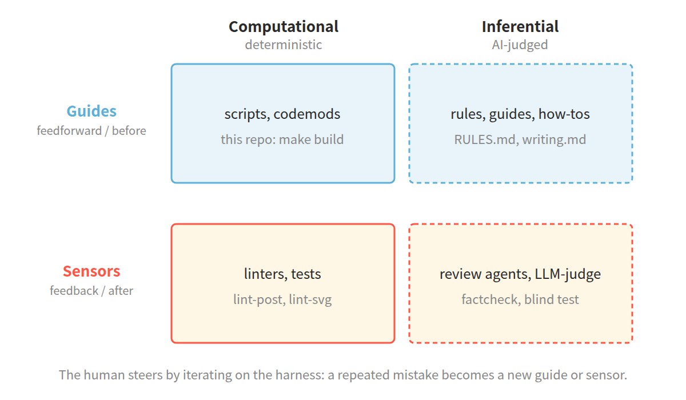

<!-- DIAGRAM-LEDGER
guides/sensors 2×2 → 그림 (harness_2x2) | 두 축의 교차라 표보다 배치가 의미를 전달
파이프라인 → 산문 + ASCII 흐름도 | 순서 전달엔 충분, 그림 불필요
린트·callout 예시 → 코드블록 | 실제 출력·before/after 가 곧 시각자료
실측이 규칙을 뒤집은 목록 → 표 | 문서 vs 실측 비교라 §3.4 표가 맞음
-->
# blog-harness

*[Read this in English](README.md)*

**이 저장소는 블로그가 아니다. 블로그 글을 발행 전에 검사하고 변환하는 기계다.**

기술 글은 [Obsidian](https://obsidian.md)(로컬 마크다운 노트)에 쓰고
[Tistory](https://www.tistory.com)에 발행한다. 글 본문은 그 두 곳에 있지 이
저장소에 있지 않다. 이 저장소에 있는 건 초안과 발행본 사이에 놓인
린터·변환기·팩트체커다.

한 사람의 블로그를 위한 사적 도구다. 그대로 가져다 쓸 일은 별로 없을 것이다. 읽어볼
지점이 있다면 뒤에 깔린 실험 쪽이다. 컴파일러가 없는 도메인에 harness engineering을
적용해 본 것이다. 옮겨갈 수 있는 건 아래 아이디어이고, SVG 좌표 계산 같은 세부는
아니다.

## 왜 만들었나

글을 어떻게 쓰고, 다이어그램을 어떻게 그리고, 태그와 카테고리를 어떻게 붙일지 적어둔
설계 문서를 다섯 개 갖고 있었다. 안 지켜졌다. 문서가 틀려서가 아니라 강제력이
없어서다. 가이드에 "이렇게 해주세요"라고 써두면 LLM이 무시한다.

Birgitta Böckeler(Martin Fowler의 "Exploring Gen AI" 시리즈)는 하네스를 이렇게
모델링한다. 에이전트가 행동하기 *전에* 방향을 잡는 *가이드(guides)*와 행동한 *뒤에*
확인하는 *센서(sensors)*, 그리고 각각은 결정론적인 *computational*이거나 AI가 판정하는
*inferential*이다. 사람은 하네스를 고쳐 가며 에이전트를 조종한다.



그림의 아래 칸(센서)엔 지금은 `lint-post`·`factcheck`가 있지만 처음엔 전부 비어
있었다. 가이드만 문서로 있었고, 사람 하나가 문서 다섯 개를 손으로 대조하며 센싱을
전부 했다. 그건 확장되지도, 버티지도 못한다.

그래서 규칙은 하나다. **기계로 검사할 수 있는 규칙은 문서에서 꺼내 코드로 옮긴다.**
그리고 에이전트가 실수하면 나무라는 프롬프트를 덧대지 말고, 그 부류의 실수가 재발할
수 없게 시스템을 바꾼다.

## 파이프라인

초안이 위에서 아래로 흐른다. `make` 스텝은 기계가 하고, 번호 붙은 게이트는 사람만
판단할 수 있는 지점이다. 게이트 ①은 맨 위, 초안을 쓰는 일 자체다.

```
drafts/<slug>.md
     ↓ make lint-svg      SVG 다이어그램 규격 (좌표·팔레트·크기)
     ↓ 사람: 다이어그램 검수             ← 게이트 ②  의미가 전달되는가
     ↓ make check         죽은 링크·태그·카테고리·본문 규칙
     ↓ make factcheck     출처 없는 주장을 다른 모델로 크로스 검증
     ↓ humanize-korean    "AI 티" 제거. 기계가 쓴 티가 나는 문장을 걷어냄
★ 최종 파일 확정
     ├→ Obsidian 아카이브 (callout 문법 그대로)
     └→ make build → posts/<slug>.md (callout 문법 → HTML)
     ↓ make thumbnail-prompt
     ↓ 사람: 프롬프트를 이미지 모델에 붙여넣기   ← 게이트 ③
     ↓ make thumbnail-check + 블라인드 테스트
     ↓ 사람: Tistory 발행                       ← 게이트 ④
```

게이트는 의도한 것이다. 기계는 기계로 잡을 수 있는 것만 잡고, 사람은 사람만 판단할
수 있는 걸 판단한다 (다이어그램이 의미를 전달하는가, 썸네일이 의도한 개념으로 읽히는가).
기계가 더 잘하는 검사를 사람이 손으로 하지 않으면, 기계가 못 하는 판단에 사람의
시간이 남는다.

## 실제로 어떻게 생겼나

기계 스텝 두 개를 구체적으로 본다.

**검사.** 린터가 초안을 읽고, 출력하는 규칙마다 그 규칙을 정의한 문서로 되돌아가는
ID를 달아 준다. 실수 세 개를 심어둔 초안에서 나온 실제 출력이다.

```
  [WARN] POST-12: 극적 수사 "심장이다" (line 6): "이 개념이야말로 알고리즘의 심장이다."
         — 담백하게. writing.md §4.3
  [WARN] POST-13: [IMG:] 파일명 'dp_missing_diagram' 을 diagrams/ 에서 못 찾음 (line 12)
         — 오타인가? 설명이면 파일명 꼴(소문자_밑줄)을 피한다.
  [WARN] POST-14: 수식 안 밑줄 `_` 이 2개 (line 8)
         — Tistory 마크다운이 `_..._` 를 기울임으로 먹어 KaTeX 가 깨진다. 아래첨자
           2개 이상은 평문으로.

1개 검사 — ERROR 0, WARN 2
```

이 세 규칙은 첫 글을 쓰다 낸 실수에서 나왔다 ("첫 실전" 참고). 셋 다 이번에 새로
코드가 됐고, 이제 발행 전 린트에서 걸린다.

**변환.** 초안은 한 번, Obsidian callout 문법으로 쓴다. 빌드 스텝이 callout을
Tistory 스킨이 색을 입히는 HTML로 결정론적으로 바꾼다. Tistory가 `<blockquote>`
안의 마크다운을 파싱하지 않아서, 백틱을 그냥 두면 리터럴 백틱으로 노출되기
때문이다.

```markdown
> [!important] 시간복잡도
> 평균 `O(log n)`.
```

↓ `make build`

```html
<blockquote class="markdown-callout markdown-callout-important">
  <p class="callout-title">시간복잡도</p>
  <p>평균 <code>O(log n)</code>.</p>
</blockquote>
```

이 변환은 LLM이 손으로 하지 않고 순수 함수로 처리한다. 글은 한 문법으로 한 번만
쓰고, HTML은 빌드 산출물이다.

## 규칙 계약

`guides/RULES.md`가 린터의 계약서다. 원칙은 둘이다.

- **여기 있는 것만 코드가 된다. 여기 없는 것은 검사하지 않는다.**
- **false positive 금지.** 멀쩡한 걸 잡으면 사람이 린터를 무시하게 되고, 그 순간
  하네스는 죽는다. 애매하면 등급을 내린다 (ERROR → WARN → INFO).

규칙은 ID·수준·조건·출처와 함께 정의된다. 린터 에러가 규칙 ID를 출력하고, 그 ID로
규칙을 정의한 문서를 찾아간다. 이 README에는 규칙 개수를 일부러 쓰지 않았다. 개수는
오직 한 곳, `RULES.md`에만 살고 세는 건 기계가 한다 ("명세는 한 곳에만" 참고).

### 검사하지 않는 것

계약서는 하네스가 **검사하지 않는** 것들의 목록으로 끝난다. 기계로 못 잡기 때문이다.

- 다이어그램이 실제로 의미를 전달하는가. 사람이 본다 (게이트 ②).
- 썸네일 오브젝트 선정. 초안 전체를 읽어야 알 수 있어서 Claude가 판단한다. 룩업
  테이블로는 안 된다.
- 썸네일이 의도한 개념으로 읽히는가. 블라인드 테스트가 판정한다. 다른 세션에 이미지
  하나만 던지고, 제목도 설명도 없이 무슨 개념으로 보이는지 묻는다.
- 넓은 톤 판단(정의 직술, 1인칭, 절차 안내). 의미 판단이 필요하다. 특정 극적 관용구
  몇 개는 예외로, 정확한 문구 목록이라 POST-12가 잡는다.
- 한글 글의 "AI 티". `humanize-korean` 도구가 잡는다.
- 강의 내 실습 주제 태그. 문맥 의존이라, 실습 주제인지 도메인 개념인지 기계는 모른다.

이 목록이 중요하다. 린터가 만능인 척하면 사람이 검수를 안 하게 된다.

## 명세는 한 곳에만

명세는 딱 한 곳에만 존재해야 한다. 카테고리 목록과 썸네일 색 매핑은 **문서의 기계
판독 블록을 파싱한다.** 린터에 상수로 박지 않는다.

```
<!-- CATEGORIES:BEGIN -->
Embedded
...
<!-- CATEGORIES:END -->
```

이유는 이렇다. 자라는 목록을 코드에 박으면 반드시 어긋난다. 실제로 그랬다. `OSS
Tools` 카테고리가 실재하는데 상수에는 없었다. 그래서 경계를 이렇게 둔다. **자라는
목록은 문서에서 파싱하고, 변하지 않는 물리 상수(SVG 기하)는 규칙 ID 주석을 달아
코드에 박는다.**

## 실측이 규칙을 뒤집은 사례

이 기계를 만들며 가장 배운 지점은, 실측이 설계 문서를 뒤집는 걸 지켜본 것이다. 아래는
전부 문서만 읽었으면 못 잡았다.

| 문서가 말한 것 | 실측이 보여준 것 |
|---|---|
| viewBox 상한 720 | 900 (개발자 도구로 확인) |
| callout에 백틱 금지 | 변환기가 `<code>`로 바꾼다 (렌더 테스트로 확인) |
| — | LaTeX 보호 필요 (`$a*b*c$`가 `$a <em>b</em> c$`로 깨졌다) |
| 본문 대시 금지 | 구조적 구분자는 허용 (77회 중 11회만 실제 위반) |
| 정의 직술에 1인칭 금지 | 판단 주체만 금지. 예시 참여자는 허용 |
| 태그 복수형 = ERROR | WARN (Redis·HTTPS·macOS 오탐) |
| — | Tistory가 `$$…$$` 안 `_..._`를 기울임으로 먹는다. 아래첨자 하나는 렌더되고 둘은 KaTeX가 깨진다 (POST-14) |

## 첫 실전

Phase 0~6 구현 완료. callout → HTML `make build` 스텝을 포함한다. 오랫동안 이
README는 여기서 "아직 실제 글로 파이프라인을 돌려본 적이 없다"는 문장으로 끝났다.

이제 돌렸다. 첫 글은 동적 계획법 입문이었고, 린트 → 다이어그램 검수 →
팩트체크(두 번째 모델로 크로스 검증) → 휴머나이즈 → 빌드 → 썸네일 → 블라인드
테스트 → 발행까지 갔다. 도중에 세 군데서 문제가 나왔고, 각 자리는 새 프롬프트가
아니라 새 규칙이 됐다.

- 영화 대본 같은 극적인 문장이 한 줄 새어 나갔다. **POST-12**가 그런 관용구 목록을
  파싱해 잡게 됐다.
- `[IMG:]` placeholder가 존재하지 않는 다이어그램 파일명을 가리켰다. **POST-13**이
  그 파일명을 `diagrams/`와 대조하게 됐다.
- 아래첨자 두 개짜리 블록 수식이 Obsidian에선 멀쩡했는데 Tistory에서 깨졌다.
  **POST-14**가 수식 안 밑줄 짝을 잡게 됐다.

재발할 수 있는 실수를 발행 뒤가 아니라 린트 시점에 걸리는 검사로 바꾼 것이다. 이
저장소가 하려는 일이 그거다.

## 재사용한 것

이미 세상에 있는 바퀴는 다시 만들지 않았다.

| 도구 | 역할 |
|---|---|
| [lychee](https://github.com/lycheeverse/lychee) | 죽은 링크 검사 |
| [humanize-korean](https://github.com/epoko77-ai/im-not-ai) | 한글 "AI 티" 제거 (도구 이름은 `humanize-korean`, `im-not-ai`는 그 repo다) |
| ce-compound | 학습 축적 (Compound Engineering 플러그인에서 fork) |

자작한 건 세상에 없는 도메인 규칙뿐이다. SVG 좌표 검산, Obsidian → Tistory callout
변환, 4축 태그 컨벤션.

## 라이선스

MIT. [LICENSE](LICENSE) 참고.

벤더링한 `ce-compound` 스킬은 Compound Engineering 플러그인(역시 MIT)의 fork다.
출처와 수정 내역은
[.claude/skills/ce-compound/THIRD-PARTY-NOTICES.md](.claude/skills/ce-compound/THIRD-PARTY-NOTICES.md)
에 있다.

## 참고 — 하네스 엔지니어링

이 프로젝트는 하네스 엔지니어링을 **비-코딩** 도메인에 적용한 것이다.
Superpowers·Compound Engineering·Ouroboros·grill-me-codex를 봤지만 전부 코딩
하네스였고, 그것들이 딛고 선 척추(컴파일러·린터·테스트)가 블로그엔 없다. 그 척추를
여기서는 손으로 세워야 했다.

- Birgitta Böckeler, "Harness Engineering" (martinfowler.com) —
  <https://martinfowler.com/articles/exploring-gen-ai/harness-engineering.html>
- Chad Fowler, "Relocating Rigor" —
  <https://www.honeycomb.io/blog/production-is-where-the-rigor-goes>
